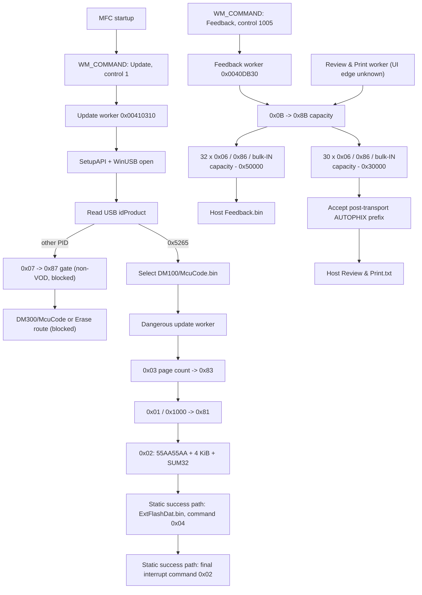

# Official Updater State Machine

Date: 2026-07-26

Machine-readable record: [`knowledge/updater_state_machine.json`](../knowledge/updater_state_machine.json).
This report reconstructs only paths supported by the static PE analysis and
the private official-updater captures. The exact MFC `WM_COMMAND` edges for
the `Update` and `Feedback` controls are now statically recovered. The
Review & Print UI edge and all unretained post-update USB traffic remain
**UNKNOWN**.

## Evidence boundary

- **PHYSICALLY_VERIFIED**: controlled physical VOD700 `0x0B` exchange.
- **CAPTURE_VERIFIED**: real USBPcap records produced by the official updater.
- **STATIC_ANALYSIS_SUPPORTED**: x86 PE code, imports, string references, and
  direct call relationships.
- **UNKNOWN**: no capture/code path currently proves the claim.

No updater was executed for this analysis. No command was replayed, patched, or
sent by the project.

## Transport foundation

`Update.exe` is a PE32/x86 MFC application (image base `0x00400000`; SHA-256
`F705FB6C6276FA52F75DD88269408D5CF061048F5EEB5451212EB1986D862C4D`). Its
device path is:

```text
SetupDi* enumeration -> CreateFileA -> WinUsb_Initialize -> WinUsb_QueryPipe
    -> WinUsb_{Read,Write}Pipe with overlapped I/O
```

The static wrappers at `0x004097F0` (read) and `0x00409AB0` (write) enumerate
pipes dynamically. The capture-correlated selector mapping is:

| Selector | Endpoint | Use |
|---:|---|---|
| 0 | `0x81` interrupt IN | 16-byte response read |
| 1 | `0x01` interrupt OUT | 16-byte request write |
| 2 | `0x82` bulk IN | framed tail-storage read |
| 3 | `0x02` bulk OUT | dangerous update page write |

There is no import of `WinUsb_ControlTransfer` or `DeviceIoControl`. The
observed vendor protocol therefore uses WinUSB pipe I/O, not a discovered
vendor control-transfer path.

## Recovered UI dispatch

Two dialog command-map records are structurally recovered from `.rdata`:

| Dialog control | Map record | Handler | Worker callback | Evidence |
|---|---:|---:|---:|---|
| `Update` (ID 1) | `0x008CBA68` | `0x0040CFB0` | `0x00410310` | STATIC_ANALYSIS_SUPPORTED |
| `Feedback` (ID 1005) | `0x008CBA80` | `0x0040D000` | `0x0040DB30` | STATIC_ANALYSIS_SUPPORTED |

Each handler pushes its callback and dialog pointer before calling the same
MFC worker-thread-launcher candidate at `0x00439380`. The Update callback is
the artifact/update worker; the Feedback callback is the capacity/tail-read
worker. This is why the captured `0x0B`/`0x06` sequence is attributed to the
Feedback route rather than assumed to be an Update-button preflight.

## Recovered worker graph



The two tail-retrieval workers and the firmware-update worker are all present
in the same executable. A capture does **not** prove that the tail workers are
preconditions of firmware transfer, or that they are reached by the same UI
action in every run.

## State and transition evidence

| State | Trigger / condition | USB operation | Expected result | Failure behavior | Evidence | Safety |
|---|---|---|---|---|---|---|
| Update dispatch | `WM_COMMAND`, control ID 1 | none; launch callback `0x00410310` | update worker begins | launcher behavior unknown | STATIC | host UI only |
| Feedback dispatch | `WM_COMMAND`, control ID 1005 | none; launch callback `0x0040DB30` | feedback worker begins | launcher behavior unknown | STATIC | host UI only |
| Enumerate/open | matching SetupAPI interface | standard Windows/WinUSB open and pipe query | valid pipe map | worker/UI error path; exact text unknown | STATIC | standard reads only |
| PID selection | `idProduct == 0x5265` | standard descriptor read | select `bin\DM100\McuCode.bin` | non-VOD branch uses a different `0x07` path | STATIC | host-side only |
| Non-VOD gate | PID is not `0x5265` | static `0x07` / expected `0x87`; compare payload with `1.26` | choose DM300 McuCode or Erase path | dangerous alternate-device route | STATIC | dangerous, blocked |
| Capacity query | tail worker begins | `0x0B` on `0x01`, then `0x8B` on `0x81` | LE value `0x02000000` | static fallback has an `0x06` probe; not live-captured | PHYSICAL + CAPTURE + STATIC | opt-in read-only only |
| Feedback tail loop | successful capacity query | 32 x `0x06` / `0x86`, bulk IN `0x1008` | `AA55AA55 + 4096 bytes + SUM32BE` | worker error; third captured request was cancelled by containment | CAPTURE + STATIC | blocked |
| Review & Print tail loop | separate worker | 30 x same request/read shape | data starts `AUTOPHIX` after transport header | host renders `Review & Print.txt`; exact UI failure text unknown | STATIC | blocked |
| Update prepare | dangerous worker has source artifact | `0x03` with big-endian page count | `0x83` | return failure/re-enable UI controls | CAPTURE + STATIC | dangerous, blocked |
| Update page handshake | page ready | `0x01 10 00` | `0x81` | no bulk transfer on failed ack | CAPTURE + STATIC | dangerous, blocked |
| Update bulk page | full 4 KiB page | `0x02`, `55AA55AA + page + SUM32BE` | following response is unknown in retained capture | dangerous worker returns failure | CAPTURE + STATIC | dangerous, blocked |
| ExtFlash stage | command-`0x03` worker success path | host opens `ExtFlashDat.bin`; worker command `0x04`, page count `0x1D36` | static expected `0x84`; no capture | UI failure branch | STATIC | dangerous, blocked |
| Final `0x02` interrupt stage | command-`0x04` worker success path | dangerous worker constructs zero-page-count `0x02` | static expected `0x82`; no capture | UI failure branch | STATIC | dangerous, blocked |

## Confirmed worker details

### Capacity and feedback tail path

`Update.exe+0x0040E670` builds `0x0B`, expects `0x8B`, and interprets response
bytes 3–6 as a little-endian capacity. The worker at `+0x0040DB30` subtracts
`0x50000`, allocates a `0x20000` host buffer, and requests 32 pages at a
`0x1000` stride. It requests `0x1008` bytes from bulk-IN, discards the first
four transport bytes, and copies 4096 bytes per page before making
`Feedback.bin`.

The first private updater capture shows the first two addresses:

```text
0x01FB0000 -> 0x86 -> 0x82: 4096 + 8 bytes, valid SUM32
0x01FB1000 -> 0x86 -> 0x82: 4096 + 8 bytes, valid SUM32
0x01FB2000 -> completion status 0xC0010000, no device acknowledgement captured
```

`0xC0010000` is the commonly defined `USBD_STATUS_CANCELED`; it is the capture
controller's containment outcome, not a VOD700 status frame. See the
[libusb Windows USB status definition](https://android.googlesource.com/platform/external/libusb/+/refs/heads/pie-arc/libusb/os/windows_usbdk.c).

The recovered MFC control map directly connects this worker to `Feedback` ID
1005. The capture controller did not retain a UI-control event, so its
historical operator interaction must not be used to relabel these bytes as an
Update-button preflight.

### Separate Review & Print tail path

The distinct worker at `Update.exe+0x0040EFB0` subtracts `0x30000`, allocates
`0x1E000`, and loops 30 pages. After each `0x06`/bulk-IN shape it tests the
first eight post-transport data bytes for ASCII `AUTOPHIX`; it then processes
additional unknown fields and creates `Review & Print.txt` on the host.

This establishes a second bounded storage window and an application-level data
signature, but there is no matching live capture. The word `AUTOPHIX` does not
identify an MCU, flash chip, or on-device filesystem.

### Dangerous firmware-transfer path

The update worker at `Update.exe+0x00411330` calculates
`ceil(source_size / 0x1000)` and puts that count big-endian in the `0x03`
frame. The retained official capture shows `0x0047` (71), exactly matching the
known DM100 `McuCode.bin` length of 287,552 bytes.

The shared update interrupt helper applies a 10,000 ms write timeout and a
20,000 ms response-read timeout. Its per-page bulk write and following
interrupt read use 10,000 ms. These are static updater settings, not a safe
client retry policy.

For each full page, it sends `0x01 10 00`, expects `0x81`, then submits:

```text
55 AA 55 AA | 4096 raw source bytes | big-endian SUM32 of prior 4100 bytes
```

The offline matcher verifies that the first captured page is byte-for-byte the
first page of DM100 `McuCode.bin`; both have SHA-256
`D0D028CE79946A7DB54E4B0D7A424085AC15CE4273007FC9D007F5B781CA313B`.
This proves a host-side raw copy in this worker. It does **not** prove the
opaque file's inner format or the device-side behavior after receipt.

The Update callback's static success path then formats `ExtFlashDat.bin` and
calls the same dangerous worker with command `0x04` (`+0x00410F10`). Its known
file size yields a big-endian page count of `0x1D36`, so the static request is
`55AA041D360000000000000000000056` and `0x84` is the expected response
command. After this stage the worker constructs final interrupt command `0x02`
with a zero page-count argument at `+0x00411002`, giving static request
`55AA0200000000000000000000000001` and expected response command `0x82`.
Those transactions have no retained USBPcap records, remain blocked, and their
device effects are UNKNOWN.

`0x00411330` takes its early return only for command `0x02`; command `0x04`
therefore follows the same static per-page `0x01` handshake and pipe-selector-3
bulk-OUT loop as the captured command-`0x03` stage. This establishes a
dangerous code relationship, not a license to infer or transmit any unobserved
ExtFlash payload.

### Non-VOD alternate-family path

When the product descriptor does not report `0x5265`, the same worker builds a
zero-payload `0x07` request (`55AA0700000000000000000000000006`), expects
`0x87`, and compares response bytes after the 3-byte response prefix with ASCII
`1.26`. The match path selects `DM300\McuCode.bin`; the non-match path tries
`DM300\Erase.bin` then `bin\Erase.bin`, before dangerous worker calls. This is
a static-only, non-VOD branch. It establishes neither a VOD700 version request
nor any safe command semantics.

## Open state-machine questions

- Review & Print UI-to-worker handler.
- The normal response after a bulk update page and the post-update sequence.
- Device effects and unretained response traffic of the static ExtFlash
  command-`0x04` and final interrupt command-`0x02` stages.
- Semantic meaning of the static-only non-VOD `0x07`, of `0x0A`, and of the
  previously unretained `0x05` response.
- Retry counts beyond the timeout constants; no retry loop is capture-verified.
- Whether the two tail windows are nonvolatile flash, a filesystem, or another
  logical storage service.

All unknown or dangerous states remain unavailable to the active client.
